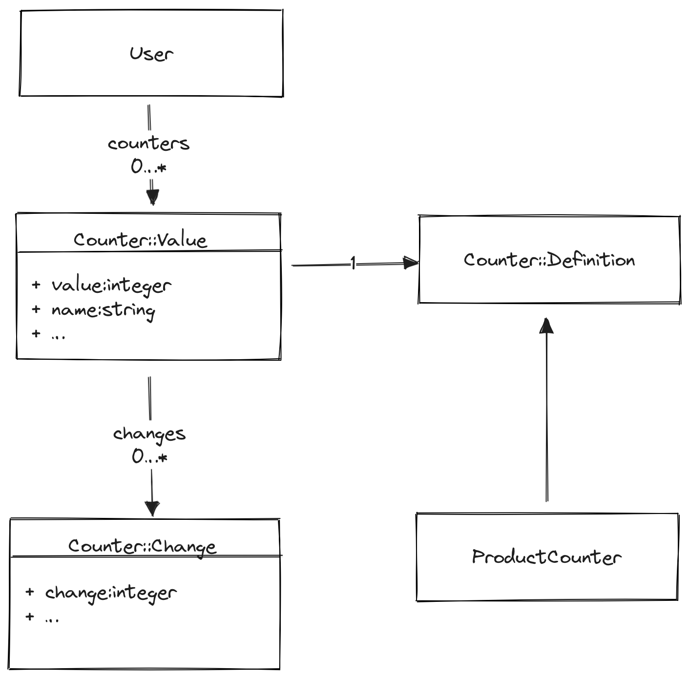

# Counter

[](https://github.com/podia/counter/actions/workflows/ruby.yml)

Counting and aggregation library for Rails.

- [Counter](#counter)
  - [Main concepts](#main-concepts)
  - [Defining a counter](#defining-a-counter)
  - [Accessing counter values](#accessing-counter-values)
  - [Anonymous counters](#anonymous-counters)
  - [Defining a conditional counter](#defining-a-conditional-counter)
  - [Aggregating a value (e.g. sum of order revenue)](#aggregating-a-value-eg-sum-of-order-revenue)
  - [Recalculating a counter](#recalculating-a-counter)
  - [Reset a counter](#reset-a-counter)
  - [Verify a counter](#verify-a-counter)
  - [TODO](#todo)
  - [Usage](#usage)
  - [Installation](#installation)
  - [Contributing](#contributing)
  - [License](#license)

By the time you need Rails counter_caches you probably have other needs too. You probably want to sum column values and you probably have enough throughput that updating a single column value will cause lock contention problems too.

Counter is different from other solutions like [Rails counter caches](https://api.rubyonrails.org/classes/ActiveRecord/CounterCache/ClassMethods.html) and [counter_culture](https://github.com/magnusvk/counter_culture):

- Counters are objects. This makes it possible for them to have an API that allows you to define them, reset, and recalculate them. The definition of a counter is seperate from the value
- Counters are persisted as a ActiveRecord models (_not_ a column of an existing model)
- Incrementing counters can be safely performed in a background job via a change event/deferred reconciliation pattern
- Avoids lock-contention found in other solutions. By storing the value in another object we reduce the contention on the main e.g. User instance. This is only a small improvement though. By using the background change event pattern, we can batch perform the updates reducing the number of processes requiring a lock.
- Counters can also perform aggregation (e.g. sum of column values instead of counting rows)


## Main concepts



`Counter::Definition` defines what the counter is, what model it's connected to, what association it counts, how the count is performed etc. You create a subclass of `Counter::Definition` and call a few class methods to configure it. The definition is available through `counter.definition` for any counter value…

`Counter::Value` is the value of a counter. So, for example, a User might have many Posts, so a User would have a `counters` association containing a `Counter::Value` for the number of posts. Counters can be accessed via their name `user.posts_counter` or via the `find_counter` method on the association, e.g. `user.counters.find_counter PostCounter`

`Counter::Change` is a temporary record that records a change to a counter. Instead of updating a counter directly, which requires obtaining a lock on it to perform it safely and atomically, a new `Change` event is inserted into the table. On regular intervals, the `Counter::Value` is updated by incrementing the value by the sum of all outstanding changes. This requires much less frequent locks at the expense of eventual consistency.

For example, you might have many background jobs running concurrently, inserting hundreds/thousands of rows. The would not need to fight for a lock to update the counter and would only need to insert Counter::Change rows. The counter would then be updated, in a single operation, by summing all the persisted change values.

Basically updating a counter value requires this SQL:

```sql
UPDATE counter_values
-- Update the counter with the sum of pending changes
SET value = value + changes.sum
FROM (
  -- Find the pending changes for the counter
  SELECT sum(value) as sum
  FROM counter_changes
  WHERE counter_id = 100
) as changes
WHERE id = 100
```

Or even reconcile all pending counters in a single statement:

```sql
UPDATE counter_values
SET value = value + changes.sum
FROM (
  SELECT sum(value)
  FROM counter_changes
  GROUP BY counter_id
) as changes
WHERE counters.id = counter_id
```

## Defining a counter

Counters are defined in a seperate class using a small DSL.

Given a `Store` with many `Order`s, it would be defined as…

```ruby
class OrderCounter < Counter::Definition
  count :orders
end

class Store < ApplicationRecord
  include Counter::Counters

  has_many :orders
  counter OrderCounter
end
```

First we define the counter class itself using `count` to specify the association we're counting, then "attach" it to the parent Store model.

By default, the counter will be available as `<association>_counter`, e.g. `store.orders_counter`. To customise this, pass a `as` parameter:

```ruby
class OrderCounter < Counter::Definition
  include Counter::Counters
  count :orders, as: :total_orders
end

store.total_orders
```

The counter's value with be stored as a `Counter::Value` with the name prefixed by the model name. e.g. `store_total_orders`

## Accessing counter values

Since counters are represented as objects, you need to call `value` on them to retrieve the count.

```ruby
store.total_orders        #=> Counter::Value
store.total_orders.value  #=> 200
```

## Anonymous counters

Most counters are associated with a model instance and association. These counters are automatically incremented when the associated collection changes  but sometimes you just need a global counter that you can increment.

```ruby
class GlobalOrderCounter < Counter::Definition
  global :my_custom_counter_name
end

GlobalOrderCounter.counter.value #=> 5
GlobalOrderCounter.counter.increment! #=> 6
```

## Defining a conditional counter

Consider this model that we'd like to count but we don't want to count all products, just the premium ones with a price >= 1000

```ruby
class Product < ApplicationRecord
  include Counter::Counters
  include Counter::Changable

  belongs_to :user

  scope :premium, -> { where("price >= 1000") }

  def premium?
    price >= 1000
  end
end
```

Here's the counter to do that:

```ruby
class PremiumProductCounter < Counter::Definition
  # Define the association we're counting
  count :premium_products

  conditional create: ->(product) { product.premium? },
    delete: ->(product) { product.premium? },
    update: ->(product) {
      became_premium = product.has_changed? :price,
        from: ->(price) { price < 1000 },
        to: ->(price) { price >= 1000 }
      return 1 if became_premium

      became_not_premium = product.has_changed? :price,
        from: ->(price) { price >= 1000 },
        to: ->(price) { price < 1000 }
      return -1 if became_not_premium

      return 0
    }
end
```

There is a lot going on here!

First, we define the counter on a scoped association. This ensures that when we call `counter.recalc()` we will count using the association's SQL.

We also define several filters that operate on the instance level, i.e. when we create/update/delete an instance. On `create` and `delete` we define a block to determine if the counter should be updated. In this case, we only increment the counter when a premium product is created, and only decrement it when a premium product is deleted.

`update` is more complex because there are three scenarios: either a product has been updated to make it premium, downgrade from premium to some other state, or changed in a way we don't care about. We need to return `1` if the instance is now premium, but wasn't before; `-1` if it was premium but now isn't; and `0` if it's premium status hasn't changed.

We use the `has_changed?` helper to query the ActiveRecord `previous_changes` hash and check what has changed. You can specify either Procs or values for `from`/`to`. If you only specify a `from` value, `to` will default to "any value"

## Aggregating a value (e.g. sum of order revenue)

Given an ActiveRecord model `Order`, we can count a storefront's revenue like so

```ruby
class Store < ApplicationRecord
  include Counter::Counters

  counter OrderRevenue
end
```

Define the counter like so

```ruby
class OrderRevenue < Counter::Definition
  count :orders
  sum :total_price
end
```

and access it like

```ruby
  store.orders.create total_price: 100
  store.orders.create total_price: 100
  store.order_revenue.value #=> 200
```

## Recalculating a counter

Counters have a habit of drifting over time, particularly if ActiveRecords hooks aren't run (e.g. with a pure SQL data migration) so you need a method of re-counting the metric. Counters make this easy because they are objects in their own right.

You could refresh a store's revenue stats with:

```ruby
store.order_revenue.recalc!
```

this would use the definition of the counter, including any option to sum a column. In the case of conditional counters, they are expected to be attached to an association which matched the conditions so the recalculated count remains accurate.

## Reset a counter

You can also reset a counter by calling `reset`. Since counters are ActiveRecord objects, you could also reset them using

```ruby
store.order_revenue.reset
Counter::Value.update value: 0
```

## Verify a counter

You might like to check if a counter is correct

```ruby
store.product_revenue.correct? #=> false
```

This will re-count / re-calculate the value and compare it to the current one. If you wish to also update the value when it's not correct, use `correct!`:

```ruby
store.product_revenue #=>200
store.product_revenue.reset!
store.product_revenue #=>0
store.product_revenue.correct? #=> false
store.product_revenue.correct! #=> false
store.product_revenue #=>200
```

---

## TODO

See the asociated project in Github but roughly I'm thinking:
- Support callbacks/hooks for when a counter is incremented/decremented. This would allow us to do things like send a notification when a counter reaches a certain value or crosses a threshold.
- Hierarchical counters. For example, a Site sends many Newsletters and each Newsletter results in many EmailMessages. Each EmailMessage can be marked as spam. How do you create counters for how many spam emails were sent at the Newsletter level and the Site level?
- Time-based counters for analytics. Instead of a User having one OrderRevenue counter, they would have an OrderRevenue counter for each day. These counters would then be used to produce a chart of their product revenue over the month. Not sure if these are just special counters or something else entirely? Do they use the same ActiveRecord model?
- Can we support floating point values? Sounds useful but don't have a use case for it right now. Would they need to be a different ActiveRecord table?
- In a similar vein of supporting different value types, can we support HLL values? Instead of increment an integer we add the items hash to a HyperLogLog so we can count unique items. An example would be counting site visits in a time-based daily counter, then combine the daily counts and still obtain an estimated number of monthly _unique_ visits. Again, not sure if this is the same ActiveRecord model or something different.
- Actually start running this in production for basic use cases

## Usage
No one has used this in production yet.

You probably shouldn't right now unless you're the sort of person that checks if something is poisonous by licking it.

## Installation
Add this line to your application's Gemfile:

```ruby
gem 'counter'
```

And then execute:
```bash
$ bundle
```

Install the model migrations:
```bash
$ rails counter:install:migrations
```

## Contributing
Contribution directions go here.

## License
The gem is available as open source under the terms of the [MIT License](https://opensource.org/licenses/MIT).
